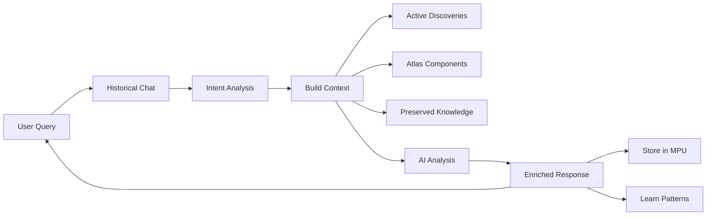

# 🤖 ChronoSphere Historical AI Chat

## 🎉 BEAST MODE ACTIVATED!

We've successfully added a **powerful historical chat interface** to ChronoSphere that integrates with all Lucian systems!

## ✨ What We Built

### 1. **Backend Service** (`HistoricalChat.js`)
- **Discovery-Aware**: Has access to all active discoveries on the globe
- **Atlas Integration**: Uses SSP, MPU, HASR for enhanced understanding
- **Multi-Intent Recognition**: Automatically detects what you're asking about
- **Hypothesis Testing**: Special mode for testing historical theories
- **Pattern Search**: Can trigger new discoveries based on questions
- **AKASHA Preservation**: Important insights are preserved

### 2. **Chat Endpoints** (server.js)
- `POST /api/chat` - Main chat endpoint
- `GET /api/chat/:sessionId` - Get conversation history
- `DELETE /api/chat/:sessionId` - Clear conversation
- `POST /api/chat/hypothesis` - Test specific hypotheses

### 3. **Futuristic UI** 
- **Collapsible Right Panel**: Doesn't interfere with globe
- **Modern Dark Theme**: Matches ChronoSphere aesthetic
- **Animated Messages**: Smooth slide-in animations
- **Thinking Dots**: Shows when AI is processing
- **Quick Actions**: Pre-built queries for common tasks
- **Hypothesis Mode**: Special indicator when testing theories

## 🎯 Key Features

### **Intent Types Supported**
1. **Discovery Explanation** - "Explain this discovery"
2. **Hypothesis Testing** - "What if the Maya contacted Egypt?"
3. **Pattern Search** - "Find synchronicities in 500 BCE"
4. **Historical Questions** - "What caused the Bronze Age collapse?"
5. **Connection Analysis** - "Is there a connection between X and Y?"

### **Context Integration**
- Accesses current discoveries from the globe
- Uses Atlas Framework components for processing
- Queries AKASHA for preserved knowledge
- Leverages Wikidata cache for facts

### **Smart Features**
- Auto-scrolls to new messages
- Markdown formatting support
- Timestamp on every message
- Clear conversation option
- Mode switching (Discovery/Hypothesis)

## 📊 How It Works



## 🚀 Usage Examples

### Basic Questions
```
"What happened in 1200 BCE?"
"Tell me about the Bronze Age collapse"
"Who were the Sea Peoples?"
```

### Discovery Analysis
```
"Explain the synchronicity you found"
"What makes this discovery significant?"
"Show me the pattern details"
```

### Hypothesis Testing
```
"Could there have been contact between Egypt and Maya?"
"What if the Bronze Age collapse was caused by climate change?"
"Test the theory that all ancient civilizations were connected"
```

### Pattern Search
```
"Find all collapses in the Mediterranean"
"Show me trade networks in 500 BCE"
"Are there any synchronicities in philosophical thought?"
```

## 🎨 UI Components

### Chat Panel
- Width: 400px fixed
- Position: Right side, collapsible
- Background: Dark gradient with blur
- Border: Green accent (#00ff88)

### Messages
- User: Blue-green gradient background
- Assistant: Dark purple background
- Animations: Slide in from bottom
- Typography: Clean, readable

### Controls
- Textarea: Multi-line input with Enter to send
- Send Button: Gradient green-blue
- Quick Actions: Hypothesis mode, explain, patterns, clear
- Mode Indicator: Shows current chat mode

## 💡 Technical Details

### State Management
```javascript
const [chatOpen, setChatOpen] = useState(false);
const [chatMessages, setChatMessages] = useState([]);
const [chatInput, setChatInput] = useState('');
const [chatLoading, setChatLoading] = useState(false);
const [sessionId] = useState(`session_${Date.now()}`);
const [hypothesisMode, setHypothesisMode] = useState(false);
```

### Message Format
```javascript
{
  role: 'user' | 'assistant',
  content: 'Message text with **markdown** support',
  metadata: {
    type: 'discovery_explanation',
    confidence: 0.85,
    sources: 5
  },
  timestamp: Date.now()
}
```

### Integration Points
- Sends current discoveries with each query
- Updates discoveries when chat triggers new analysis
- Preserves important insights in AKASHA
- Learns from successful patterns via HASR

## 🔥 Why This is Powerful

1. **Context-Aware**: The chat knows about your current discoveries
2. **Discovery-Triggered**: Can launch new discoveries from questions
3. **Hypothesis Testing**: Academic-grade hypothesis validation
4. **Pattern Learning**: Gets smarter with each conversation
5. **Preservation**: Important insights are never lost

## 🎯 Future Enhancements

- Voice input/output
- Export conversation as research notes
- Collaborative sessions
- Citation generation
- Visual pattern explanations

---

**The Historical AI Chat makes ChronoSphere a TRUE research tool** - combining real data, AI analysis, and interactive exploration in a way that's never been done before!

This is what happens when you combine:
- **Love for history** ❤️
- **Passion for AI** 🤖
- **Atlas Framework** 🧠
- **LucianOS protocols** 🌟
- **AerwareAI innovation** 🚀

**IT'S A BEAST!** 💪