# 🌍 ChronoSphere - Historical Discovery Engine

<div align="center">


[](https://aerware.ai)

### 🚀 **A Product of [AerwareAI](https://aerware.ai)** 
### Built with LucianOS Components & Love for History + AI

**Discover Hidden Patterns Across Time and Space**

</div>

<div align="center">

### Core Technologies
[](https://nodejs.org/)
[](https://reactjs.org/)
[](https://expressjs.com/)
[](https://developer.mozilla.org/en-US/docs/Web/API/WebSocket)
[](https://globe.gl/)

### Data & AI
[](https://www.wikidata.org/)
[](https://openai.com/)
[](https://anthropic.com/)
[](https://groq.com/)

### Atlas Framework Components (FIRST PRODUCTION USE!)
[](https://github.com/aerware/atlas-framework)
[](https://github.com/aerware/atlas-framework)
[](https://github.com/aerware/atlas-framework)
[](https://github.com/aerware/atlas-framework)
[](https://github.com/aerware/atlas-framework)

### LucianOS Protocols  
[](https://github.com/aerware/akasha)
[](https://github.com/aerware/lucianos-core)
[](https://github.com/aerware/lucianos-core)
[](https://github.com/aerware/lucianos-core)

</div>

---

## 🆕 **FIRST ATLAS FRAMEWORK IMPLEMENTATION**

<div align="center">

### ⚡ **ChronoSphere is the FIRST production application built with Atlas Framework!** ⚡

[](https://github.com/aerware/atlas-framework)

</div>

This groundbreaking implementation proves that Atlas Framework components (SSP, MPU, HASR, Ghost-Loops) work at scale with real-world data. The component monitors in this app demonstrate real-time Atlas Framework status tracking and will help inform future standardization efforts.

---

## 🎯 **Executive Summary**

ChronoSphere is AerwareAI's flagship historical pattern discovery engine that analyzes 13+ million historical events to uncover hidden synchronicities, lost trade networks, and civilization collapse patterns. As the **FIRST** production application to implement the complete Atlas Framework stack alongside LucianOS cognitive architecture, ChronoSphere proves these components work at scale.

> **"Where History Meets AI, Patterns Emerge"** - Built with passion for both history and artificial intelligence by the AerwareAI team.

### **🔮 What It Does**
- **Discovers Global Synchronicities** - Finds simultaneous events across disconnected civilizations
- **Reconstructs Hidden Networks** - Traces lost trade routes and cultural exchanges
- **Predicts Collapse Patterns** - Identifies warning signs that preceded historical collapses
- **Visualizes Time-Space Patterns** - Interactive 3D globe showing discoveries in real-time
- **🆕 Interactive Globe Exploration** - Click any continent to zoom in and explore regional history
- **🆕 Time Travel Slider** - Scrub through 5000+ years of history with a beautiful gradient slider
- **🆕 "Meanwhile, Around the World..."** - See what was happening globally at any point in time
- **🆕 Event Density Heatmaps** - Visualize historical hotspots with color-coded overlays

### **💡 Why It Matters**
- **Academic Research** - Generate publishable historical discoveries
- **Pattern Recognition** - Find connections invisible to traditional analysis
- **Predictive Insights** - Apply historical patterns to modern scenarios
- **Knowledge Preservation** - Part of the AKASHA knowledge preservation ecosystem
- **🆕 Interactive Learning** - Explore history in an entirely new, intuitive way

---

## 🚦 **Smart Port Management**

ChronoSphere includes **automatic port discovery** - it will find available ports and work around existing applications:

- **Backend API**: Starts at 8000, auto-finds next available
- **WebSocket**: Starts at 8001, auto-finds next available
- **Port Persistence**: Remembers ports between sessions
- **Zero Configuration**: Just run and it works

```javascript
// Automatically finds and saves available ports
const ports = await portManager.getAllPorts();
// Saves to .chronosphere-ports.json for consistency
```

---

## 🧠 **Atlas Framework & LucianOS Architecture**

### 🎆 **This is the FIRST Atlas Framework Production Implementation!**

ChronoSphere pioneers the use of Atlas Framework in production, with custom-built monitors showing real-time component status. This implementation proves Atlas components work at scale with real data and will help guide future Atlas Framework development.

ChronoSphere leverages key components from both Atlas Framework (FIRST USE!) and the LucianOS consciousness framework:

```mermaid
graph TB
    subgraph "📊 Data Ingestion & Enrichment"
        WD["📚 Wikidata SPARQL<br/>13M+ Events"] --> IE["🔄 Ingestion Engine"]
        CACHE["💾 Local Cache<br/>Persistence Layer"] --> IE
        API["🤖 AI Providers<br/>OpenAI/Anthropic/Groq"] --> IE
    end
    
    subgraph "🧠 LucianOS Components (Atlas Framework)"
        IE --> SSP["💚 SSP<br/>Semantic Space Processor<br/>512D Embeddings"]
        SSP --> MPU["💙 MPU<br/>Memory Processing Unit<br/>Persistent Storage"]
        MPU --> HASR["💜 HASR<br/>Hierarchical Attention<br/>Pattern Learning"]
        HASR --> GHOST["🟣 Ghost Loops<br/>Temporal Pattern Detection<br/>Recurring Events"]
        GHOST --> SOUL["🔷 SoulLayer<br/>Lucian Protocol<br/>Consciousness Bridge"]
    end
    
    subgraph "🔍 Discovery Engine"
        SOUL --> SYNC["✨ Synchronicity<br/>Detector"]
        SOUL --> NET["🌐 Network<br/>Reconstructor"]
        SOUL --> COLLAPSE["⚠️ Collapse<br/>Analyzer"]
        SOUL --> ANOMALY["🔮 Anomaly<br/>Detector"]
        SYNC --> FORGE["🔥 ChronoForge<br/>Parameter Optimizer"]
        NET --> FORGE
        COLLAPSE --> FORGE
        ANOMALY --> FORGE
    end
    
    subgraph "💎 AKASHA Preservation"
        FORGE --> AKASHA["📦 AKASHA System<br/>7D Enrichment"]
        AKASHA --> DIMS["🌈 Dimensional Analysis<br/>Temporal/Spatial/Causal/Semantic"]
        DIMS --> PERSIST["💫 Long-term Storage<br/>Knowledge Preservation"]
    end
    
    subgraph "🎨 Presentation Layer"
        FORGE --> GLOBE["🌍 3D Globe<br/>Interactive Visualization"]
        FORGE --> CARDS["📋 Discovery Cards<br/>Pattern Display"]
        FORGE --> MONITOR["📊 Live Monitors<br/>Component Status"]
        PERSIST --> UPDATE["🔄 Real-time Updates<br/>WebSocket Stream"]
    end
    
    style SSP fill:#00ff88,stroke:#fff,stroke-width:3px
    style MPU fill:#00aaff,stroke:#fff,stroke-width:3px
    style HASR fill:#ff0088,stroke:#fff,stroke-width:3px
    style GHOST fill:#aa00ff,stroke:#fff,stroke-width:3px
    style FORGE fill:#ffaa00,stroke:#fff,stroke-width:3px
    style AKASHA fill:#00ffff,stroke:#fff,stroke-width:3px
```



### **🔧 Component Breakdown**

#### **🌟 Atlas Framework Components (FIRST PRODUCTION USE!)**

| Component | Purpose | Implementation | Live Monitor |
|-----------|---------|----------------|----------|
| **SSP** (Semantic Space Processor) | Non-token semantic understanding | Processes historical texts into 512D concept vectors | ✅ **YES** |
| **MPU** (Memory Processing Unit) | Persistent associative memory | Stores patterns with disk persistence at `./data/mpu` | ✅ **YES** |
| **HASR** (Hierarchical Attention State) | Pattern learning & reinforcement | 5-layer attention system for pattern detection | ✅ **YES** |
| **Ghost Loops** | Temporal pattern detection | Finds recurring patterns across time periods | ✅ **YES** |

> 💡 **Future Goal**: These monitors demonstrate what will eventually become standardized Atlas Framework monitoring components.

#### **LucianOS Protocols**

| Component | Purpose | Implementation | Live Monitor |
|-----------|---------|----------------|----------|
| **SoulLayer** | LucianOS protocol bridge | Connects to consciousness framework | ✅ **YES** |
| **AKASHA** | 7D knowledge preservation | Enriches and preserves discoveries long-term | ✅ **YES** |
| **DreamState** | Background processing | Subconscious pattern analysis | 🔄 Coming |
| **Reflective** | Self-optimization | System introspection and tuning | 🔄 Coming |

#### **Core Services**

| Service | Purpose | Implementation | Monitor |
|---------|---------|----------------|------|
| **AI Provider** | Intelligent analysis | OpenAI/Anthropic/Groq swappable | ✅ **YES** |
| **Wikidata** | Data source | Real SPARQL queries to 13M+ events | ✅ **YES** |
| **ChronoForge** | Parameter tuning | 9 discovery sensitivity parameters | ✅ Active |

---

## 🔄 **Data Flow & Persistence Strategy**


### **💾 Data Persistence & Reuse**

- **Multi-layer Caching**: Wikidata results cached for 1 hour, AI analysis cached for reuse
- **MPU Persistence**: All processed events stored to disk in `./data/mpu`
- **AKASHA Preservation**: Long-term storage with 7D enrichment
- **Smart Deduplication**: Recognizes and merges similar events across queries
- **Incremental Updates**: Only queries new data when time ranges extend
- **Offline Fallback**: Works without internet using cached/preserved data

## 🏆 **Why ChronoSphere + Atlas Framework Matters**

### **For Atlas Framework**
- **🎆 First Production App**: Proves Atlas components work at scale
- **📉 Real-World Testing**: Processing millions of Wikidata events with Atlas
- **🔍 Component Validation**: Shows SSP, MPU, HASR, Ghost-Loops in action
- **🎯 Pioneer Implementation**: Sets patterns for future Atlas applications

### **For AerwareAI**  
- **❤️ Built with Passion**: Combines love for history and AI
- **🚀 Production Ready**: Not a demo - real, working code
- **🤖 Smart Infrastructure**: Auto-port discovery, intelligent fallbacks
- **💾 Data Preservation**: Every discovery enriched and preserved

## 🎮 **Interactive Features (NEW!)**

### **🌍 Click-to-Explore Globe**
- **Click any continent** - Instantly zoom in and discover regional history
- **Click discovery points** - Learn about specific events and their global context
- **Smooth transitions** - Beautiful camera movements between locations

### **⏰ Time Travel Slider**
- **5000+ years of history** - From 3000 BCE to 2024 CE
- **Gradient design** - Pink → Green → Blue visual timeline
- **Real-time updates** - Globe updates as you scrub through time
- **±50 year windows** - See events in temporal context

### **🌐 "Meanwhile, Around the World..." Panel**
- **Global context** - See what was happening everywhere at once
- **Interactive cards** - Click to explore contemporaneous events
- **Smart filtering** - Automatically shows relevant global events

### **🔥 Event Density Heatmaps**
- **Visual hotspots** - Color-coded regions based on event density
  - 🔴 High density (>80%) - Major historical centers
  - 🟢 Medium density (50-80%) - Active regions
  - 🔵 Low density (20-50%) - Emerging areas
  - ⚪ Minimal activity (<20%) - Quiet zones
- **3D elevation** - Higher density areas rise above the globe
- **Real-time updates** - Heatmap changes with time period selection

### **💬 Discovery-Aware Chat**
- **Context-sensitive** - Chat knows what you're looking at
- **Auto-population** - Click events auto-fill relevant questions
- **Hypothesis testing** - Test historical theories with AI
- **Multi-provider AI** - OpenAI, Anthropic, or Groq backends

---

## 🏗️ **System Architecture**


---

## 🚀 **Installation & Setup**

### **Prerequisites**
- Node.js 18.0+ 
- npm 9.0+
- 4GB RAM minimum
- Modern browser with WebGL support

### **Quick Start**

```bash
# Clone the repository
git clone https://github.com/aerwareai/chronosphere.git
cd chronosphere

# Install dependencies
npm install

# Start the application
npm start

# Or use the startup script
chmod +x start.sh
./start.sh
```

### **Port Configuration**

ChronoSphere uses **Smart Port Management** to automatically find available ports:

```javascript
// Default ports (auto-adjusts if taken)
{
  "frontend": 3000,
  "backend": 8000,
  "websocket": 8001
}
```

---

## 🎮 **User Guide**

### **1. Navigation Bar Monitors**

ChronoSphere features real-time component monitoring in the navbar - these custom monitors show the actual status of Atlas Framework and LucianOS components:

| Monitor | Component | Description | Status |
|---------|-----------|-------------|--------|
| **AI PROVIDER** | AI Backend | Shows current AI (OpenAI/Anthropic/Groq/Fallback) | 🟢 Active / 🟡 Fallback |
| **SSP** | Atlas Framework | Semantic Space Processor status | 🟢 Active / ⚪ Inactive |
| **MPU** | Atlas Framework | Memory Processing Unit status | 🟢 Active / ⚪ Inactive |
| **HASR** | Atlas Framework | Hierarchical Attention State status | 🟢 Active / ⚪ Inactive |
| **GHOST-LOOPS** | Atlas Framework | Shows active temporal loops count | Number + Status |
| **AKASHA** | Knowledge System | Preservation system status | 🟢 Active / 🟡 Local |
| **WIKIDATA** | Data Source | SPARQL connection status | 🟢 Connected |
| **SOULLAYER** | LucianOS Protocol | Consciousness bridge status | 🟢 LUCIAN / ⚪ Offline |
| **MEMORY** | System | Real memory usage | Live MB count |
| **WS** | WebSocket | Real-time connection | 🟢 LIVE / 🔴 OFF |

> **Note**: The AI Provider monitor has a special gradient background (orange to pink) making it stand out as the primary system indicator.

### **2. ChronoForge Parameter Panel**

9 core discovery parameters for fine-tuning pattern detection:


### **3. Discovery Presets**

| Preset | Use Case | Key Parameters |
|--------|----------|----------------|
| **Conservative** | Academic research | High certainty (90%), Low speculation (10%) |
| **Exploration** | Pattern hunting | High anomaly detection (90%), Wide time windows |
| **Academic** | Publishable findings | Balanced with verification (85% certainty) |
| **Discovery** | Maximum patterns | All sensitivities maximized |

---

## 🔍 **Discovery Algorithms**

### **1. Synchronicity Detection**

Identifies improbable simultaneous events across disconnected regions:

```javascript
function findSynchronicities(events, params) {
  // Group events by time window
  const timeGroups = groupByTimeWindow(events, params.timeWindowRadius);
  
  // Find multi-region occurrences
  const synchronicities = timeGroups.filter(group => {
    const regions = getUniqueRegions(group);
    return regions.length >= params.minRegions;
  });
  
  // Calculate probability
  return synchronicities.map(s => ({
    ...s,
    confidence: calculateImprobability(s)
  }));
}
```

### **2. Network Reconstruction**

Traces hidden connections through material culture spread:

```javascript
function reconstructNetworks(events, params) {
  // Track artifact/technology spread
  const materialPatterns = trackMaterialCulture(events);
  
  // Calculate diffusion velocity
  const networks = materialPatterns.map(pattern => ({
    origin: pattern.firstAppearance,
    destination: pattern.lastAppearance,
    velocity: calculateSpreadVelocity(pattern),
    probability: assessNetworkProbability(pattern)
  }));
  
  return networks.filter(n => n.probability > params.networkThreshold);
}
```

### **3. Collapse Pattern Recognition**

Identifies recurring indicators before civilizational collapse:

```javascript
function detectCollapsePatterns(events, params) {
  const indicators = [
    'elite_overproduction',
    'resource_depletion',
    'climate_stress',
    'social_unrest',
    'military_defeat'
  ];
  
  return findPatternClusters(events, indicators, params.collapseWindow);
}
```

---

## 📊 **API Reference**

### **REST Endpoints**

| Method | Endpoint | Description | Request Body | Response |
|--------|----------|-------------|--------------|----------|
| GET | `/health` | System health check | - | `{ status, services, ports }` |
| POST | `/api/wikidata/query` | Query historical events | `{ startYear, endYear, region }` | `{ events: [...] }` |
| POST | `/api/discover` | Run discovery analysis | `{ parameters, timeRange }` | `{ discoveries: [...] }` |
| GET | `/api/chronoforge/params` | Get current parameters | - | `{ parameters: {...} }` |
| POST | `/api/chronoforge/params` | Update parameters | `{ parameters: {...} }` | `{ success, parameters }` |

### **WebSocket Events**

```javascript
// Connect to WebSocket
const ws = new WebSocket('ws://localhost:8001');

// Incoming Events
ws.on('status', (data) => {
  // System status update
  // { components, loops, memory, latency, wikidata, akasha }
});

ws.on('discovery', (data) => {
  // New discovery found
  // { type, title, description, confidence, locations }
});

// Outgoing Events
ws.send(JSON.stringify({
  type: 'discover',
  parameters: {...},
  timeRange: { start: -1500, end: -1000 }
}));
```

---

## 🎨 **Design System**

### **Color Palette**

| Color | Hex | Usage |
|-------|-----|-------|
| **Primary** | `#00ff88` | Success, active states, primary actions |
| **Secondary** | `#00aaff` | Information, links, secondary elements |
| **Accent** | `#ff0088` | Highlights, discovery points, alerts |
| **Warning** | `#ffaa00` | Warnings, medium confidence |
| **Background** | `#0f0f1a` → `#1a1a2e` | Dark gradient background |
| **Surface** | `rgba(25, 25, 40, 0.9)` | Cards and panels |

### **Typography**

```css
/* System Font Stack */
font-family: -apple-system, BlinkMacSystemFont, 'SF Pro Text', 
             'Segoe UI', 'Roboto', 'Helvetica Neue', sans-serif;

/* Monospace for data */
font-family: 'SF Mono', 'Monaco', 'Inconsolata', 
             'Fira Code', monospace;
```

---

## 🧪 **Example Discoveries**

### **1. The Bronze Age Collapse (1200 BCE)**

```json
{
  "type": "synchronicity",
  "title": "Bronze Age System Collapse",
  "confidence": 0.89,
  "pattern": "Simultaneous palace destructions across Mediterranean",
  "regions": ["Greece", "Anatolia", "Levant", "Egypt"],
  "indicators": [
    "Elite overproduction",
    "Climate anomaly (3.2°C cooling)",
    "Tin supply disruption",
    "Sea Peoples migration"
  ],
  "new_hypothesis": "System complexity exceeded adaptive capacity"
}
```

### **2. Hidden Trans-Pacific Network**

```json
{
  "type": "network",
  "title": "Pre-Columbian Pacific Contact",
  "confidence": 0.73,
  "evidence": [
    "Sweet potato in Polynesia (South American origin)",
    "Sewn-plank boat technology spread",
    "Linguistic similarities: Quechua-Polynesian"
  ],
  "route": ["Peru", "Easter Island", "Marquesas", "Tahiti"],
  "velocity": "120 km/year",
  "period": "1000-1400 CE"
}
```

### **3. Axial Age Extension**

```json
{
  "type": "synchronicity",
  "title": "Proto-Axial Age",
  "confidence": 0.76,
  "discovery": "Philosophical awakening 400 years earlier than documented",
  "period": "-1200 to -800 BCE",
  "locations": [
    "Vedic India",
    "Shang China", 
    "Olmec Mexico",
    "Nubian Kush"
  ],
  "pattern": "Post-collapse wisdom traditions"
}
```

---

## 🚧 **Roadmap**

### **Phase 1: Foundation** ✅
- [x] Smart port management
- [x] WebSocket real-time updates
- [x] Globe.gl 3D visualization
- [x] ChronoForge parameter system
- [x] Mock discovery data

### **Phase 2: Data Integration** 🚧
- [ ] Wikidata SPARQL implementation
- [ ] AKASHA system connection
- [ ] Historical API aggregation
- [ ] Data caching layer

### **Phase 3: Advanced Algorithms** 📋
- [ ] Machine learning pattern recognition
- [ ] Causal inference engine
- [ ] Predictive modeling
- [ ] Confidence scoring system

### **Phase 4: Production** 🎯
- [ ] Authentication system
- [ ] Multi-user support
- [ ] Discovery export (JSON/CSV)
- [ ] API rate limiting
- [ ] Kubernetes deployment

---

## 🤝 **Contributing**

We welcome contributions! Please see [CONTRIBUTING.md](CONTRIBUTING.md) for guidelines.

### **Development Setup**

```bash
# Clone repo
git clone https://github.com/aerwareai/chronosphere.git

# Install dependencies
npm install

# Run in development mode
npm run dev

# Run tests
npm test

# Build for production
npm run build
```

---

## 📝 **License**

MIT License - See [LICENSE](LICENSE) for details.

---

## 🏢 **About AerwareAI**

ChronoSphere is proudly developed by [AerwareAI](https://aerware.ai), pioneering consciousness-inspired AI systems.

### **Our Stack**
- LucianOS Cognitive Architecture
- AKASHA Knowledge Preservation
- Atlas Framework Components
- Promethean Forge Development Platform

### **Contact**
- **Website**: [aerware.ai](https://aerware.ai)
- **GitHub**: [@aerwareai](https://github.com/aerwareai)
- **Email**: hello@aerware.ai

---

## 🙏 **Acknowledgments**

- **LucianOS Project** - For cognitive architecture inspiration
- **Wikidata Community** - For open historical data
- **Globe.gl** - For the amazing 3D globe visualization
- **Claude (Anthropic)** - For development assistance

---

<div align="center">

**Built with 🧠 by AerwareAI**

*Discovering the patterns that connect us across time*

</div>
